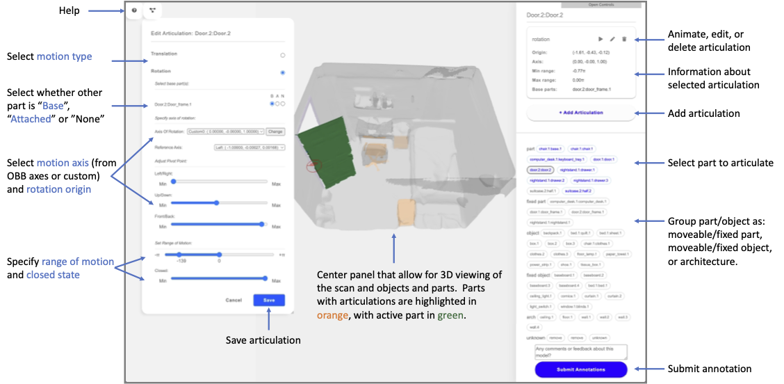
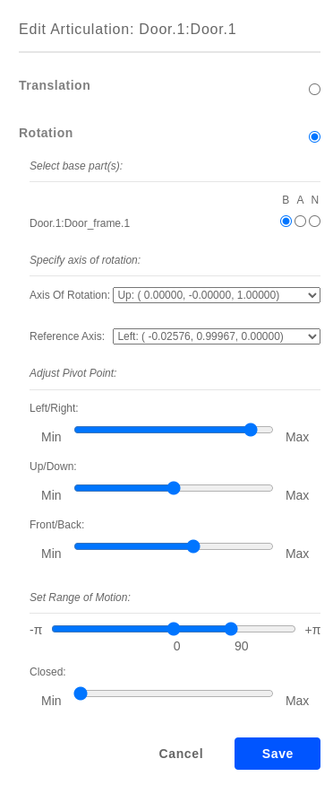
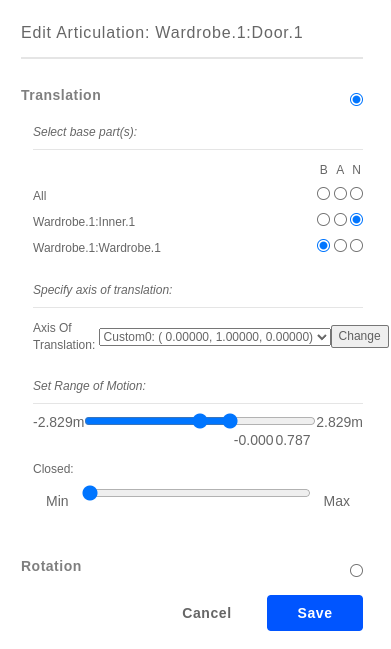
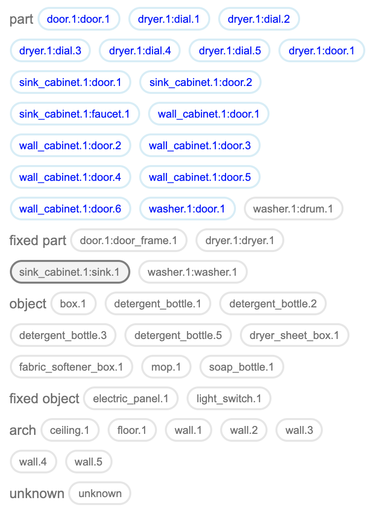

Articulation Annotation
=======================

After semantic annotation, we specify the articulation parameters for all articulating object parts using a separate interface (see screenshot below). Click on each previously segmented part to define a translational or rotational articulation, by choosing the base of the joint, specifying the orientation of the joint, and defining the range of motion. The interface will animate the part to visualize the defined articulation. After finishing the articulation annotations, you can click on the ``Submit Annotations`` blue button to save the current annotations. Take a look at this `articulated kitchen`_ example.

.. note:: Articulation annotation can only be done after segmentation annotation is finished.

.. _articulated kitchen: https://aspis.cmpt.sfu.ca/stk-multiscan/motion-annotator?labelType=object-part&useDatGui=true&modelId=multiscan.20210509T153245-0700_552BCC11-1AF7-44AC-8CDD-602FC7B795F9

Instructions
------------

#. Left-click articulated objects parts in the 3D view. Then select ``Add articulation``, and select articulation type on the left panel.

#. Select the ``base parts`` (i.e. parts against which current part articulates) and specify the parts connectivity.
    * **B**: base parts
    * **A**: attached parts
    * **N**: not connected

#. Select the axis of articulation and tweak its position using the sliders. By default 6 axes are provided for the part: `Up`, `Down`, `Left`, `Right`, `Front`, `Back`. Use `Add custom` in the drop down window to customize the axis.

#. The reference axis determines the `zero point` of the articulation (and is visualized as a `red axis line` in the `radar circle` shown during annotation. The `red axis line` in the radar indicates where the `zero point` occurs.  The `blue line` indicates the current angle value of the object's articulation state.  The highlighted red sector is the range of articulation values that are currently annotated as possible using the slider.

#. Set the range realistically (e.g., avoid any “swinging inwards of cabinet doors, avoid any over-swinging) by dragging one of the range slider notches to the middle point.

#. Press ``C`` key to toggle the `textured view` to look for door and cabinet handles etc. in order to determine in which direction things articulate.

#. Play back articulations to verify them by left-clicking an annotated part and pressing the play button.

#. Click ``Submit`` when done. A message should display saying the annotation is saved, after which it is safe to close the tab.

.. list-table::
    :widths: 1 1
    :header-rows: 1

    * - rotation
      - translation
    * - |articulation-rotation|
      - |articulation-translation|

.. todo::
    1. add axis direction determination rule based on right-hand rule
    2. instruction for closed state annotations

Grouping Parts by Type
----------------------

The interface also provides functionality for specifying part/object type, shown as a ``grouping`` of the part labels.  Each part label can belong to one of the following groups:

* **part** = movable part (we drop the word movable in the UI for a cleaner interface)
    #. Either an articulated part (door) or a part that can come off (bottle cap)
    #. For objects with parts, if the entire object can move, then the base part of the object should be considered a movable part (e.g. chair base)
* **fixed part** = part that is fixed and cannot move (door frame, cabinet base)
* **object** = movable object (e.g. chair, bottle)
* **fixed object** = object that cannot be moved (e.g. light switch, electric panel, big stationary furniture).
* **arch** = architecture element (wall, ceiling, floor)

Double click on object label and select **arch** from the little select pull down.
You can also use shortcut keys ``M`` and ``F`` after clicking a part/object label to specify that a part/object is movable or fixed

