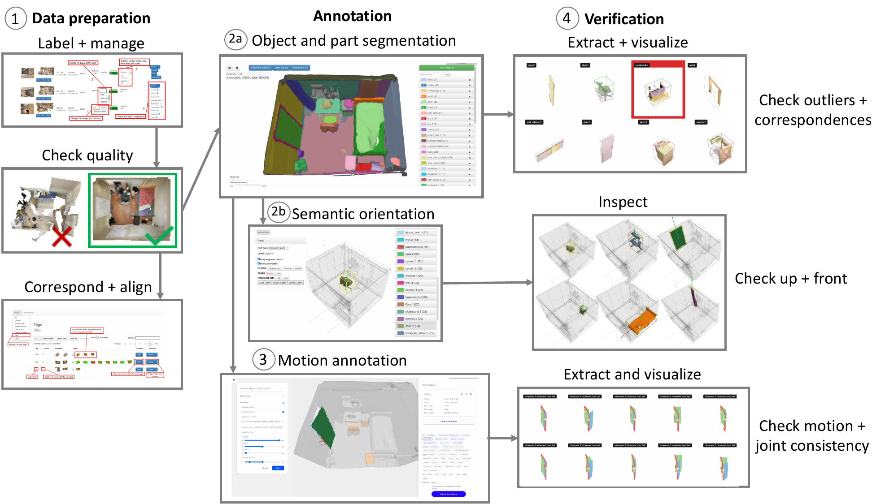

Annotations
===========

.. toctree::
    :maxdepth: 1

    semantic
    obb
    articulation

Our annotation framework consists of several phases: 1) reconstruction quality check and scan alignment; 2) semantic annotation of objects and parts; 3) semantic OBB annotation of objects; 4) motion annotation; and 5) verification.

Following Figure illustrates the annotation flow:

We create a management UI for labeling scans, and inspecting reconstructed scan quality. Scans that pass the reconstruction quality check are then corresponded and aligned, and continue to the annotation phases. During annotation, the scan is semantically segmented and objects and parts are labeled (2a). The objects are then semantically annotated with their up and front directions (2b). Objects and parts are also annotated with their motion parameters (3). At the end of each annotation phase, verification (4) is performed, and errors are corrected if necessary.
