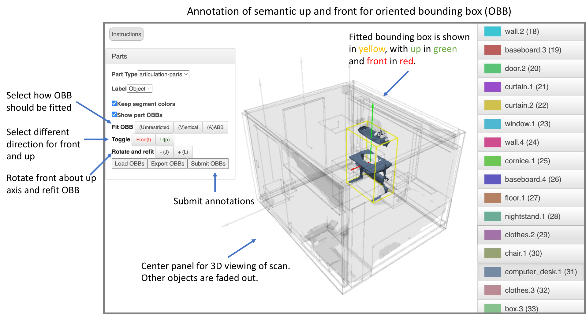

Semantic OBB Annotation
=======================

Semantic OBB (Object bounding box) annotation interface is provided for semantically specify meaningful OBBs with `up` and `front` directions at the object and part level. Use ``PgUp``/``PgDown`` (``Fn`` + ``Up``/``Down`` for mac keyboards) to select different labeled objects/parts.

Instructions
------------

Click on the label of the object int the right window, the precomputed OBB will be visualized on the canvas. Following steps bellow to refine the OBB if needed.

**OBB pose**
    * Press ``J`` and ``L`` buttons, to reorient and refit the OBB around `front` and `up` directions. Most of the time, the precomputed OBB should look good
    * Press ``U``, ``V`` and `A` buttons, to change the OBB computation method between `Unrestricted`, `Vertical` and `AABB`.

**Front direction**
    * Visualized as red arrow
    * Articulated objects: the front direction points to the side toward which the object opens
    * Rigid objects: the front direction points to a person when the person tries to interact with it
    * Press ``T`` to change the front direction vector

**Up direction**
    * Opposite to the gravity direction, perpendicular to the floor, and pointing to the ceiling or sky
    * If the object is tilted, the up direction tilts accordingly
    * Press ``P`` to change the up direction vector

