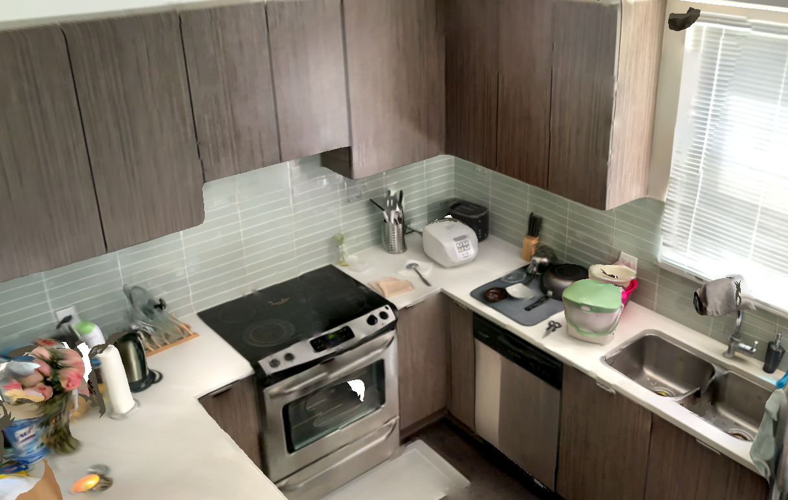
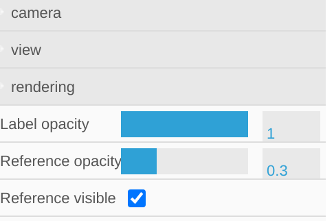

Semantic Annotation
===================

Instructions
------------

We use a semantic annotation interface to “paint” each object and each of its parts in a different color. As shown in the figure below:

First, user adds a semantic label to the right list panel with label `<object_name>.<object_instance_id>:<part_name>.<part_instance_id>`. And a random color will be assigned to the brush, use the brush to annotate the objects and the corresponding parts.

In the bottom left, the slide bars are used to tweak the brush size. When the fine level is set in the second slide bar, the brush size is set to a fixed size in the topper slide bar. Otherwise, the brush size is set to the area pre-segmented by the graph-based hierarchical segmentator.
After all the annotations, click on the ``Next`` button to save the current annotation and navigate to other scans. Take a look at this `annotated kitchen`_ for an example of a fully annotated scene.

Label convention details:

- Have a separate `<part_name>` for all object parts that can articulate relative to the base object.  Parts that do not articulate relative to the base object can all be taken together as the “base rigid object”. Name these parts `<object_name>.<object_instace_id>:<object_name>.<part_instace_id>`.  In other words `<part_name> = <object_name>`. See `Object Labeling Guidelines`_ for more details on the distinction between movable and articulating objects.
- If the object is completely static and fixed in place (e.g., floors, walls), only use <object_name>.<object_instance_id> (i.e. there is no :<part_name>.<part_instance_id>)
- Some examples. Objects with no parts: ``wall.1``, ``wall.2``, ``floor.1``, ``ceiling.1``, ``ceiling_light.1`` Objects with parts: ``cabinet.1:door.1``, ``cabinet.1:door.2``, ``cabinet.1:drawer.1``
- If there are many small objects inside an opened drawer or cabinet, and are not possible to be clearly separated into shelves, use the label ``internal``, e.g. <object_name>.<object_instance_id>:internal.<part_instance_id>
- For weird floating pieces (outliers) that shouldn't be there: label them as ``remove``.

Object Labeling Guidelines
--------------------------

This guide aims to help annotators to determine articulated and movable objects in a scene.

**Articulated Object**
    An object consisting of more than one rotational or translational rigid movable part that is connected by joints. For instance, in the following image, the drawer unit on the right contains 4 articulated parts that can rigidly translate (each drawer). The oven on the left has 1 articulated part that can rigidly rotate and one translational drawer. Example articulated objects: Drawer, Cabinet, Oven, Microwave, Washing machine, dryer, door, or other objects with relatively large movable parts (diameter >= 20 cm).

**Movable Object**
    Objects that can be rigidly moved around but don’t have large, frequently moved parts. Example movable objects: chair, table, backpack, other objects that are moved from scan to scan.

.. note:: Articulated objects can also be movable objects.

To help us have consistent annotations and statistics across scenes and annotators. We define anything that rigidly moves around as one **“instance”**, and any articulated parts that are typically "installed together" as one **“instance”**. As shown in the following example, different object instances are masked with unique colors.

.. _annotated kitchen: https://aspis.cmpt.sfu.ca/stk-multiscan/multiscan/segment-annotator?condition=manual&format=textured-v1.1&segmentType=triseg-finest-hier-v1.1&modelId=multiscan.20210509T153245-0700_552BCC11-1AF7-44AC-8CDD-602FC7B795F9&taskMode=fixup&startFrom=latest

Tips and UI Details
-------------------

#. In the left bottom corner, you can see two sliders, these are used to control the brush size. There are currently 3 levels: `finer`, `fine`, `coarse`. When using the left-most finer level, the brush size can be controlled by the first slider (from left to right, the brush size increases). In the other two levels, the brush size is fixed, and uses pre-segmented clusters of triangles. |semantic-brush-slider| |semantic-brush-slider-visualize|

#. Do large segments (floor, wall, ceiling etc.) first using relatively coarse segmentation. Then freeze them (right click menu on the part name in the panel) to preserve boundaries. For walls, floors, ceilings try to keep the bounding box drawn in colored lines around the part as “flat” as possible -- you may need to exclude some corners.

#. Try to have part boundaries follow the texture boundaries as much as possible.  This may be difficult in some cases where the triangulation is not fine enough, but do your best within the limits of the current triangulation.

#. Use ``cmd/ctrl click`` on the panel list to select multiple annotated names and merge into a single part if needed.

#. In the top right corner click ``Open Controls``, and check ``Reference visible`` to show the transparent texture colors behind the annotated triangles. Then use the ``Reference opacity`` slider to control the opacity (should be < 1). |semantic-opacity|

#. Click the icons in the top left to see keyboard shortcuts and some hints about the object types. Some useful shortcuts. ``Shift+Left`` Click: Eraser. You can use the coarse brush size level first, then use the eraser to remove triangles that do not belong to the object. ``Ctrl+Z``: undo (i.e. “rollback”).

#. For mostly rectangular object parts, note that the ``R`` key will annotate all the triangles in the 3D bounding box. You can keep annotating the triangles in the bounding box, to change the shape of the bounding box (see below example):

.. list-table::
    :widths: 1 1 1
    :header-rows: 1

    * - | Paint corners of object part
      - | Merge 4 corners
      - | Press ``R`` to label all
        | triangles in the bounding box
    * - |semantic-rectangle1|
      - |semantic-rectangle2|
      - |semantic-rectangle3|

.. todo:: Annotation with Propagation