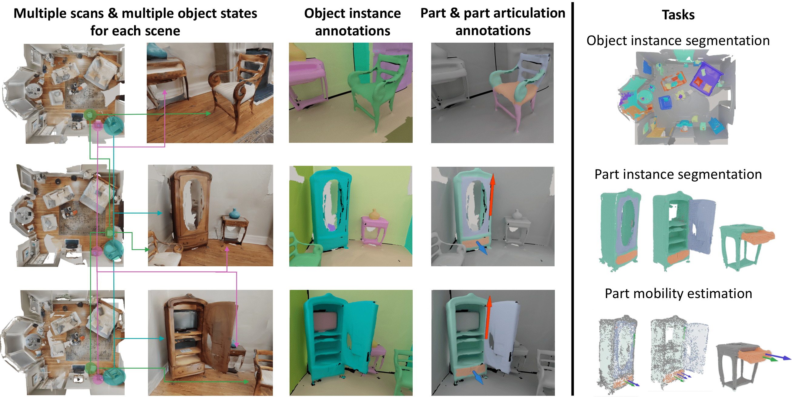

MultiScan: Scalable RGBD scanning for 3D environments with articulated objects
==============================================================================

We introduce MultiScan, a scalable RGBD dataset construction pipeline leveraging commodity mobile devices to scan indoor scenes with articulated objects and web-based semantic annotation interfaces to efficiently annotate object and part semantics and part mobility parameters. We use this pipeline to collect 230 scans of 108 indoor scenes containing 9458 objects and 4331 parts. The resulting MultiScan dataset provides RGBD streams with per-frame camera poses, textured 3D surface meshes, richly annotated part-level and object-level semantic labels, and part mobility parameters. We validate our dataset on instance segmentation and part mobility estimation tasks and benchmark methods for these tasks from prior work. Our experiments show that part segmentation and mobility estimation in real 3D scenes remain challenging despite recent progress in 3D object segmentation.

.. toctree::
    :maxdepth: 1
    :caption: Getting Started

    overview

.. toctree::
    :maxdepth: 2
    :caption: Dataset

    dataset/index

.. toctree::
    :maxdepth: 2
    :caption: Pipeline

    scanner/index
    server/index
    web-ui/index
    annotation/index

.. toctree::
    :maxdepth: 2
    :caption: Benchmarks

    benchmark/index
    benchmark/dataset

.. toctree::
    :maxdepth: 2
    :caption: References

    references
    