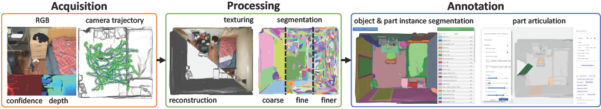

Overview
========

MultiScan is a project designed to allow researchers and developers to create scalable and densely annotated datasets using commercial mobile phones and tablets.
In this project, we use iPhones and iPads with LiDAR sensors to collect RGB-D streams, camera intrinsics and poses. The collected data can be uploaded to a staging server with sufficient free space, and be reconstructed and textured automatically. Users can browse the scans and processed results on a web interface. The web UI can be used to pair scans collected from the same scene, browse the reconstructed, textured, initially segmented meshes, redirect to segmentation and articulation annotator, etc. Part-level segmentation annotator lets users annotate the objects and parts into segments with different colors and labels. Articulation annotator lets users define the translational and rotational articulation of the parts for articulated objects.

Scanner App
-----------
The Scanner App collects data using sensors on an Android/iOS device. User moves around holding the device with Scanner app installed to scan the scene. Once the scanning is completed, users can upload the data to the staging server. Detailed documentation for iOS and Android is at |Scanner App Doc|_. View the Scanner App API |Scanner App API|_.

Processing Server
-----------------
The processing server has 3 main functionalities:

1. Stage uploaded scans by the devices (iOS or Android) and trigger scan processing. To ensure that scans can be automatically processed, the scans should be placed in a directory with lots of space and accessible to the scanning processor.
2. Process staged scans. Handle reconstruction processing request from Web-UI, when user press interactive buttons on Web-UI.
3. Index staged scans. Go through scan folders and collate information about the scans.

Reconstruction
~~~~~~~~~~~~~~
Open3D RGB-D Reconstruction Pipeline
    With acquired RGB-D data, we use the `Open3D`_ RGB-D reconstruction pipeline to produce 3D mesh reconstructions.

Post Processing
~~~~~~~~~~~~~~~

Mesh Topology Cleanup and Decimation
    We use `Instant-Meshes`_ for this task.
    The default reconstructed mesh using marching cubes from the Open3D RGB-D reconstruction pipeline usually contains millions of vertices and faces for a single bedroom, making mesh annotation and segmentation hard.
    An additional mesh topology cleanup and decimation step is performed to reduce mesh complexity and keep geometry unchanged as much as possible.

Texturing
    To improve the visual appearance of our reconstructed mesh from Open3D pipeline, the decimated mesh will be textured with framework `mvs-texturing`_.

Segmentation
    We developed on `Segmentor`_ from ScanNet for mesh segmentation. We first segment the mesh with weight from vertex normals. Then for each segmented cluster, we apply a second segmentation step with edge weights from vertex colors. Color weights are calculated by following `Toscana et al`_. The segments are used to carry out semantic annotation of the 3D mesh to extract objects and their parts.

Rendering
    Open3D triangle mesh visualization with headless rendering is used for the ply mesh visualization.
    Pyrender headless rendering with EGL GPU-accelerated rendering is used for the obj textured mesh visualization.

Web UI
------
The `Web-UI`_ is an interactive interface for providing an overview of staged scan data, managing scan data, and controlling the reconstruction and mesh annotation pipeline.

Annotation
----------
We use a web-based UI implemented using the `SmartScenes toolkit`_ to annotate individual 3D object instances and their parts.
Once objects and their parts are annotated, we then specify semantic object OBB(Oriented Bounding Box) and articulation parameters for object parts.
Specifically, we utilize the `ScanAnnotator`_ web app to carry out this annotation.

Semantic Annotation
    Semantic annotator is used to create ground truth part-level semantic labels. First, user adds a semantic label to the right list panel with name `object_id:part_id = object_category.object_index:part_category.part_index`. And a random color will be assigned to the brush, and the user can use the brush to annotate the objects and the corresponding parts.

OBB Annotation
    The OBB annotator is used to specify semantically meaningful OBBs with ``up`` and ``front`` directions at the object level.

Articulation Annotation
    Articulation annotator is used to annotate the object consisting of more than one rotational or translational rigid movable part that is connected by joints.
    With a semantically annotated scan, the user can click on each segment to define a translational or rotational articulation, by choosing the base of the joints, locate the joints and define the range of the transformation. The corresponding animation will be displayed to help users to visualize the defined articulation.

.. _Scanner App API: https://3dlg-hcvc.github.io/multiscan
.. |Scanner App API| replace:: `here`
.. _Scanner App Doc: scanner/index.html
.. |Scanner App Doc| replace:: `here`
.. _Open3D: https://github.com/intel-isl/Open3D
.. _Instant-Meshes: https://github.com/3dlg-hcvc/instant-meshes
.. _mvs-texturing: https://github.com/3dlg-hcvc/mvs-texturing.git
.. _Segmentor: https://github.com/ScanNet/ScanNet/tree/master/Segmentator
.. _Toscana et al: https://arxiv.org/abs/1605.03746
.. _Web-UI: web-ui/index.html
.. _SmartScenes toolkit: https://github.com/smartscenes/sstk
.. _ScanAnnotator: https://github.com/smartscenes/sstk/blob/master/client/js/apps/scan-net/ScanAnnotator.js