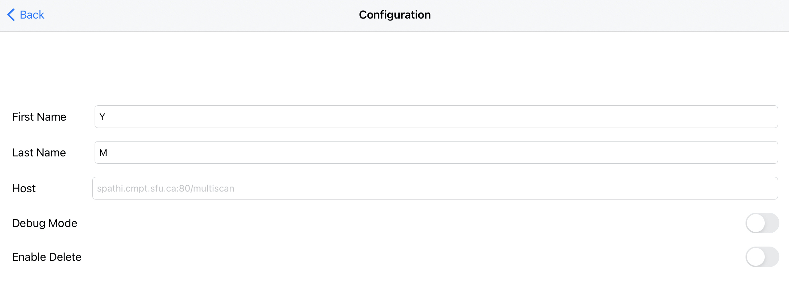
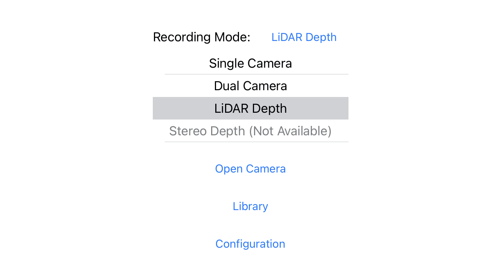
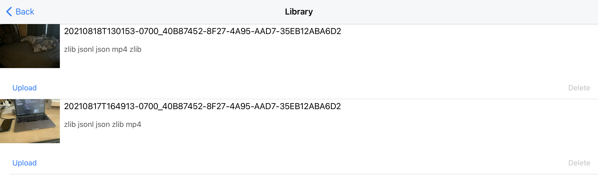
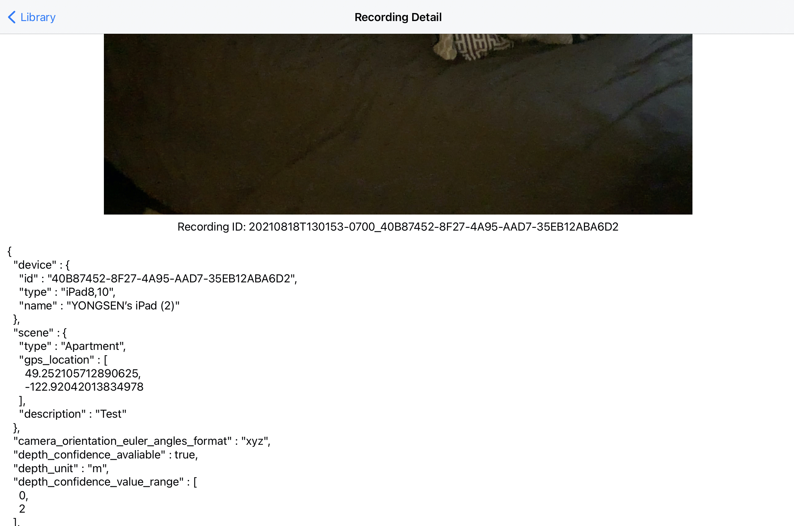
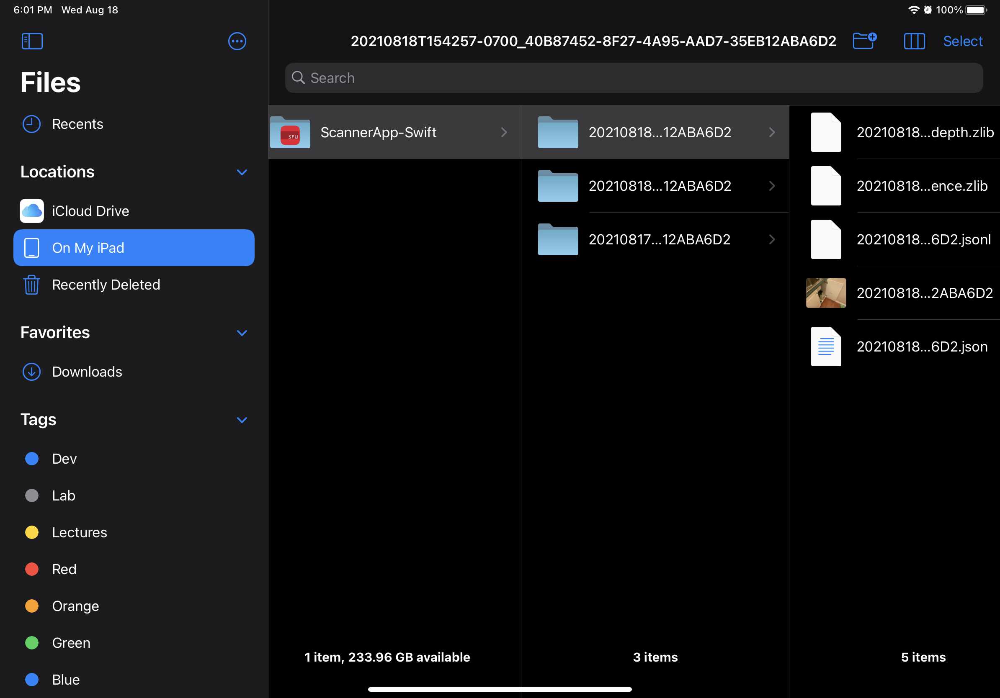
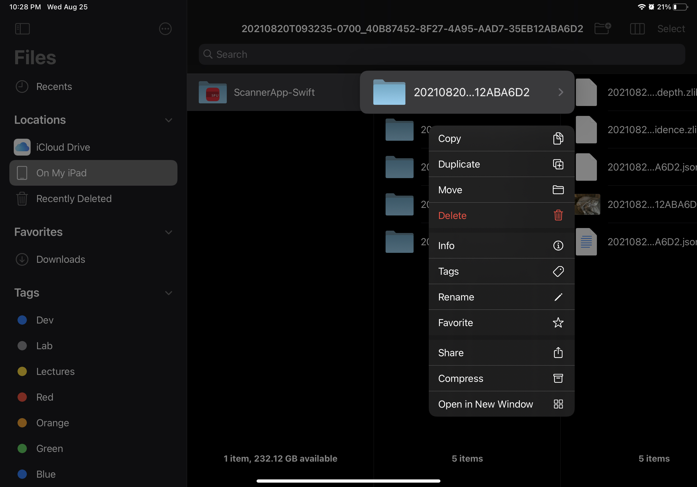
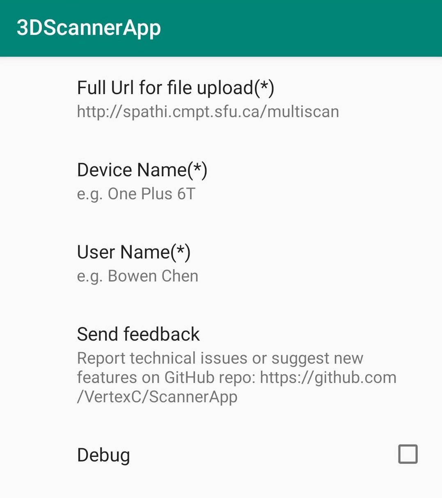
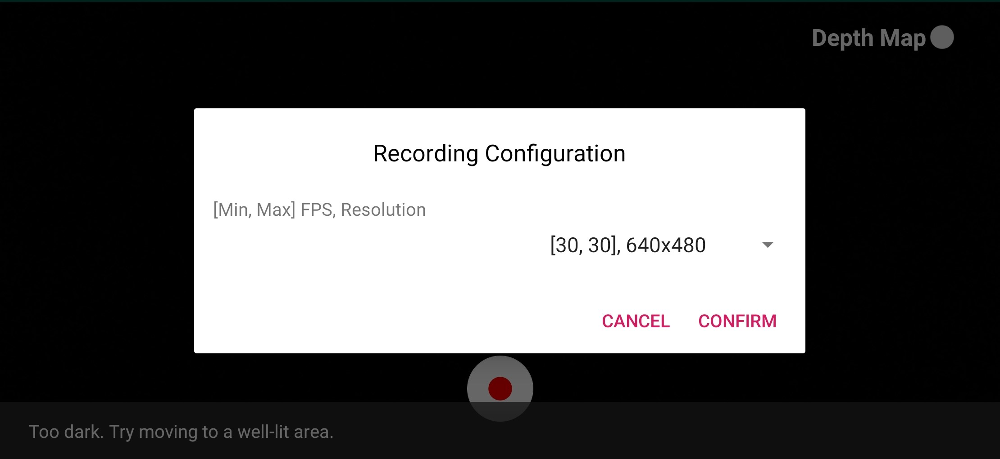

Scanner App
===========

iOS
---

The iOS Scanner App collects data using built in LIDAR sensor on an iOS device. The app collects following data for each scan:

Metadata
    Metadata file is a json file which contains user information, scene information, device information, frame rate of streams, etc.

RGB video
    The RGB videos recorded in single camera mode and RGB-D mode are at 1920 x 1440 resolution and 60 FPS.

Depth Maps and Confidence Maps
    Depth maps and confidence maps are provided by the Depth API of ARKit 4. Depth maps and confidence maps are available at 256 x 192 resolution and 60 FPS.
    We store depth as 16-bit floating number with zlib stream compression.
    Confidence maps contain corresponding confidence level of each pixel depth value. There are three confidence level low (0), medium (1) and high (2). We store them as 8-bit unsigned integers with zlib stream compression as well.

Camera Parameters
    A camera info file contains information of camera pose, camera intrinsics at each frame. Camera info files are in json line format.

.. Note:: ARKit Camera Pose Convention:

    In camera space, the x-axis points to the right when the device is in ``UIDeviceOrientation.landscapeRight orientation``. That is, the x-axis always points along the long axis of the device, from the front-facing camera toward the Home button. The y-axis points upward (with respect to ``UIDeviceOrientation.landscapeRight`` orientation), and the z-axis points away from the device on the screen side.

For detailed file formats, please refer to :doc:`Acquired Data from Scanner App <../dataset/files/acquired>`.

Requirements
~~~~~~~~~~~~

1. iOS 14.0 or newer
2. LiDAR sensor required

Installation
~~~~~~~~~~~~

1. Make sure you have installed the latest version of `Xcode`_ on your Mac computer.
2. Clone the multiscan repo.
3. Open project folder ScannerApp-Swift.xcodeproj using Xcode on Mac. This folder can be found at ``multiscan/scanner/ios``
4. In the left project navigator window, click the first project file, and select ``TARGETS`` ``ScannerApp-Swift``.
5. In Build Settings, find the field Signing/Development Team, change the team to your personal team. If you don't see your personal team option, please sign in your apple account in the ``Xcode/Preferences/Accounts``.
6. In Build Settings, find the field ``Packaging/Product Bundle Identifier``, change the identifier to username.ScannerApp.
7. On the top bar, switch device to iOS Device to your iPad.
8. Build and run the current scheme, and the scanner app should be installed to your iPad device.

User Manual
~~~~~~~~~~~

**Configuration**

From the configuration scene, users can edit user information as well as setting the host for uploading.

The ``Enable Delete`` option can be disabled to prevent users to delete scenes by accident.

**Mode Selection**

On the main screen, user can choose the recording mode. We recommend to use LiDARDepth for the best result.

**Recording**

From a recording scene, users can tap the ``Record`` button to initiate the recording process. A pop-up view will show for collecting user inputs, and once the required information is filled, users can start scanning by tapping ``Start Recording``. Users can stop scanning by tapping ``Stop`` button.

The App also uses ARKit to construct a mesh wire frame overlay to help users to record a better quality scene.

.. image:: ../_static/ios/record_flow.png

.. note::
    While recording, please hold your device in "Landscape Right" position.

    .. image:: ../_static/ios/record_orientation.jpg

Library and Uploading
~~~~~~~~~~~~~~~~~~~~~

Scans can be accessed and uploaded from the library scene. From the library scene, tap the ``Upload`` button of each scan to upload files to the staging server (Internet connection required), and tap ``Delete`` button to delete each scan. User can also tap on each row to see scan details (currently just the metadata file).

View and share the files directly using the iOS' builtin ``Files`` App. The data files of each scan will be stored in ``Files->ScannerApp-Swift->scanner_ID``

Development API
~~~~~~~~~~~~~~~

For the details about iOS scanner app APIs, please refer to `MultiScan iOS Documentation`_.

Android
-------

The Android Scanner App collects data with similar format to the iOS Scanner App. The Android Scanner App is built for `ARCore`_ supported devices. Here is link to `ARCore Supported Devices`_. ARCore supports devices with and without depth sensors, though devices with dedicated depth sensor gives more accurate depth maps.

Requirements
~~~~~~~~~~~~

1, ARCore
2. `ARCore Supported Devices`_

Installation
~~~~~~~~~~~~

**Install the app via apk file**
Download the .apk file from here and install it on your phone manually.

**Install the app via Android Studio**
#. Git clone the multiscan repo.
#. Open the android folder (located at `multiscan/scanner/android`) using Android Studio.
    #. Android Studio will show a Android sign for that folder

    .. image:: ../_static/android/android_studio_open.png

    #. Plug in your Android phone to your computer, Android Studio should be able to detect your phone automatically. You can check it by verifying the model name on top right of the Android Studio. You might see a permission dialog pop up on your phone which you need to press accept

    .. image:: ../_static/android/android_studio_tool_bar.png

    If you encounter any problems connecting your android device to Android Studio:
        * `Enable USB debugging on your phone`_
        * You should also go to ``File->Project Structure->Modules`` and change the ``compile SDK version`` to ``29`` and ``Build Tools version`` to ``24.0.3``
        *  visit `Device Connect`_ for more details

    #. Click the green play icon. Android Studio will then build the app and install it on you phone.

    .. image:: ../_static/android/android_studio_tool_bar_build.jpg

    #. Once the installation is complete, then unplug the phone and use the Scanner App for data collection.

User Manual
~~~~~~~~~~~

**Configuration**

Go to the ``Configuration`` page to input user info and server url

**Recording**

#. Click the ``VIDEO CAPTURE (ARCORE)``
#. Choose the resolution and FPS for the color frame recording

#. Use the switch on top right to toggle between camera view or depth view

    .. Note:: If you turned on the depth view and the screen is black, try move your phone around and don't start recording until you see the actual depth image.

    .. image:: ../_static/android/depth_view.png
        :width: 400
    .. image:: ../_static/android/content_dialog.png
        :width: 400

#. Click the record button
#. Choose the scene and the add your description
#. After the scanning is finished, clicking the ``stop`` recording button to stop the recording

Library and Uploading
~~~~~~~~~~~~~~~~~~~~~

Go to the Gallery page to access recorded scenes. Tab the thumbnail to replay the video and tab the upload button to upload the files to the server.

Development API
~~~~~~~~~~~~~~~

For the details about Android scanner app APIs, please refer to `MultiScan Android Documentation`_.

.. _Xcode: https://developer.apple.com/xcode/
.. _MultiScan iOS Documentation: https://3dlg-hcvc.github.io/multiscan/ios/
.. _ARCore: https://developers.google.com/ar
.. _ARCore Supported Devices: https://developers.google.com/ar/devices
.. _Enable USB debugging on your phone: https://developer.android.com/studio/debug/dev-options
.. _Device Connect: https://developer.android.com/studio/run/device#connect
.. _MultiScan Android Documentation: https://3dlg-hcvc.github.io/multiscan/android