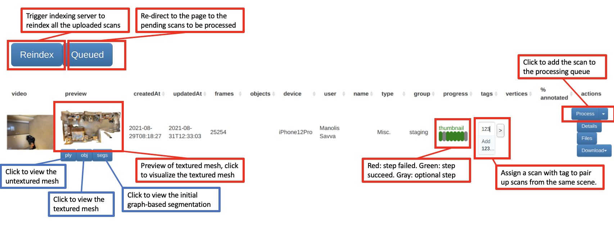
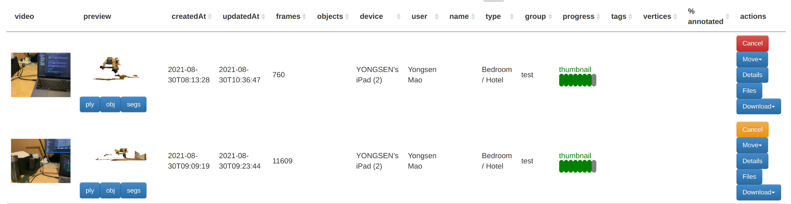
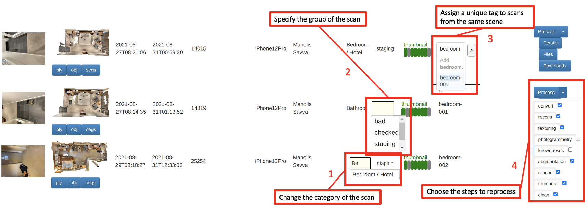
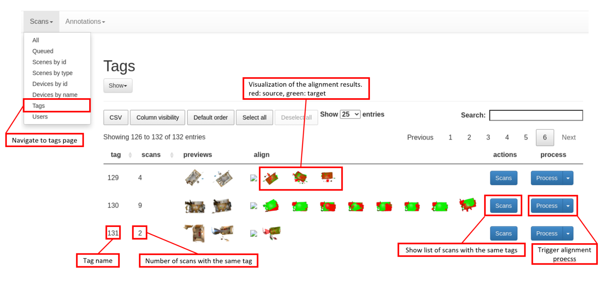

Web UI
======

Web-UI is an interactive interface for providing an overview of staged scan data, managing scan data, controlling reconstruction process and mesh annotation pipeline. We use an indexing server, to index all the uploaded scans into a single csv file, which contains the ID and the info about scans. The indexed scans will be visualized in the web UI, and allows manual reprocessing the collected scans if needed. In the following sections we explain how users setup the web UI and how to interact with it.

UI Overview
-----------

The web UI will display the indexed scans in a table, with each row corresponding to each scan. And users can interact with the web UI as follows:



The progress bar is used to check if each step is being processed without error. If the step failed, the corresponding oval button will turn red.
The ``Process`` button is used to reprocess a scan. If multiple processes are triggered on the web UI, all requests will be kept in a queue and processed one by one. Users can click on the ``Queued`` button to visualize all the scans in the queue as follows:



Sometimes it gets tricky to properly categorize a room. The user checks the scene type of the scan and modifies it to the correct category if needed (see box highlight 1).



Checking reconstruction quality
-------------------------------

Reconstruction and texture quality varies with the quality of the acquired scan from scanner app. The ``group`` field is used to distinguish between bad, good, and test scans (see box highlight 2). A ``bad`` label indicates that the scan has invalid upload files, bad rebuild results, or is to be thrown away. The user clicks on the preview image and check the cleanness, completeness and texturing quality of the textured mesh with 3D model viewer, and then label the quality of the result in the group field. By default, the group field is ``staging``, which indicates that the scan is staged and needs to be checked for quality. If the textured mesh has a large portion of floating noise points, large or many holes, textures are misaligned badly, the user marks the scan as bad. If the resulting quality is good, the user marks the scan as checked, scans with checked labels will be annotated as described in the next sections.

summary of group tags to be used:

- ``staging`` : everything starts in this group
- ``test`` : "throw away" scan
- ``multiscan`` : good scan, no significant artifacts
- ``bad`` : failed reconstruction or otherwise garbage
- ``bad-geometry`` : big holes, significant floating geometry, misalignments
- ``bad-texture`` : significant texturing issues

Manual Reprocessing
-------------------

It is not necessary to press the process button to re-process a scan, as the scan is auto-processed after uploading, and the reconstruction and texturing methods are methodical, each process should give similar or identical results. However, steps of the process can be selected in a list of checkboxes, the user can click on the drop-down arrow next to the ``Process`` button to reprocess the checked steps (see box highlight 4).

Rescans
-------

In MultiScan, we scan a scene multiple times with objects in different articulated states and poses. To correlates multiple scans collected from the same room, unique tags are used to pair scans of the same scene and separate them from scans of other scenes, as shown in the highlighted box 3. The user adds a unique label to the tag field and assigns the same label to other scans from the same scene. Scans with the same tag will be used to compute the relative transformation matrix in order to align them to the same pose, and correlate the same objects in the same scene.

Align Grouped Scans
-------------------

MultiScan has multiple scans of the same room to collect objects with different articulation states and poses in the same environment. 
After the grouping scans with the same tag, the grouped and reconstructed meshes have different coordinate frames. To align these meshes, we use a multiscale ICP-based pairwise alignment method to align the scans to a target scan, which is the earliest scan collected in the scanner app.
When using the ``Scans`` tab navigate to the Tags page, the user will see grouped scans sorted by their tag name and the number of scans under each tag. In the ``actions`` column, when pressing the ``Scans`` button, it will redirect the user to a table with scans have the same tag name. To trigger the processing server to align grouped scans, press the ``Process`` button, and all source scans will align to the target scan. The visualization of each alignment result will be shown in the ``align`` column.



Installation & Set up
---------------------

Web Client
~~~~~~~~~~

.. todo:: Add Installation doc for the new web client front end

Web Server
~~~~~~~~~~

Setting up and running the Web UI is as easy as 1, 2, 3.

1. Make sure you have `NodeJS`_ and `npm`_ installed.
2. Install the dependencies
    
    ```
    cd web-ui/web-server; npm install
    ```

3. Start your app
    
    ```
    npm start
    ```

By default web-ui will start at `http://localhost:3030/`.

**Link Staged Scans**

In order to make web-ui has access to staged scans, such as preview video, thumbnail images, etc. we need to create symbolic links to the `staging` directory. By following the command lines below:

.. code-block:: bash

    mkdir data
    mkdir data/multiscan
    mkdir data/multiscan/scans
    ln -s "$(realpath /path/to/folder/staging)" data/multiscan/scans

Then create symbolic links to the created `data` directory in `src`, `public` folder. 

.. code-block:: bash

    ln -s "$(realpath data)" src/data
    ln -s "$(realpath data)" public/data

Endpoints
---------

Web pages
~~~~~~~~~

.. list-table::
   :widths: 20 50
   :header-rows: 1
   :class: tight-table

   * - URL
     - Description
   * - /scans/manage
     - Main manage view (supports feather style querying)
   * - /scans/annotations
     - IFrame of annotations
   * - /scans/devices-id
     - Devices by id
   * - /scans/devices-name
     - Devices by name
   * - /scans/scenes
     - Scenes by name
   * - /scans/scenes-type
     - Scenes by type
   * - /scans/users
     - Users
   * - /scans/tags
     - Tags
   * - /scans/browse
     - Browse view
   * - /scans/process
     - Process queue view
   

Web services
~~~~~~~~~~~~

.. list-table::
   :widths: 20 50
   :header-rows: 1
   :class: tight-table

   * - URL
     - Description
   * - /scans/list
     - Returns json of all the scans (supports feather style querying)
   * - /scans/index
     - Reindex all scans
   * - /scans/index/<scanId>
     - Reindex specified scan
   * - /scans/monitor/convert_video/<scanId>
     - Converts h264 to mp4 and thumbnails for specified scan
   * - /scans/process/<scanId>
     - Adds scan to process queue
   * - /scans/edit
     - Edits metadata associated with a scan (follows DataTables editor client-server protocol)
   * - /scans/populate
     - Updates scans
   * - /api/stats/users
     - Returns json of scans grouped by ``userName``
   * - /api/stats/scenes_types
     - Returns json of scans grouped by ``sceneType``
   * - /api/stats/device_ids
     - Returns json of scans grouped by ``deviceId``
   * - /api/stats/tags
     - Returns json of scans grouped by ``tags``  
   * - /api/scans
     - Returns json of all the scans

.. _NodeJS: https://nodejs.org/
.. _npm: https://www.npmjs.com/


