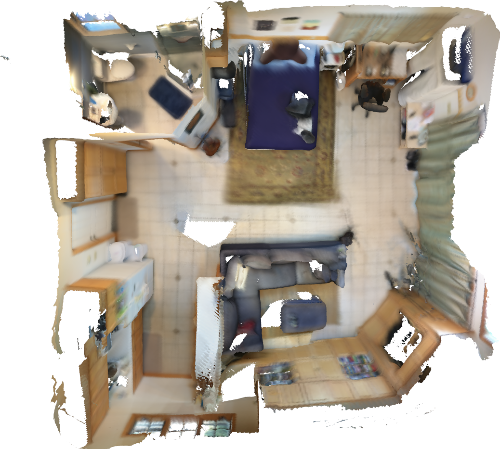
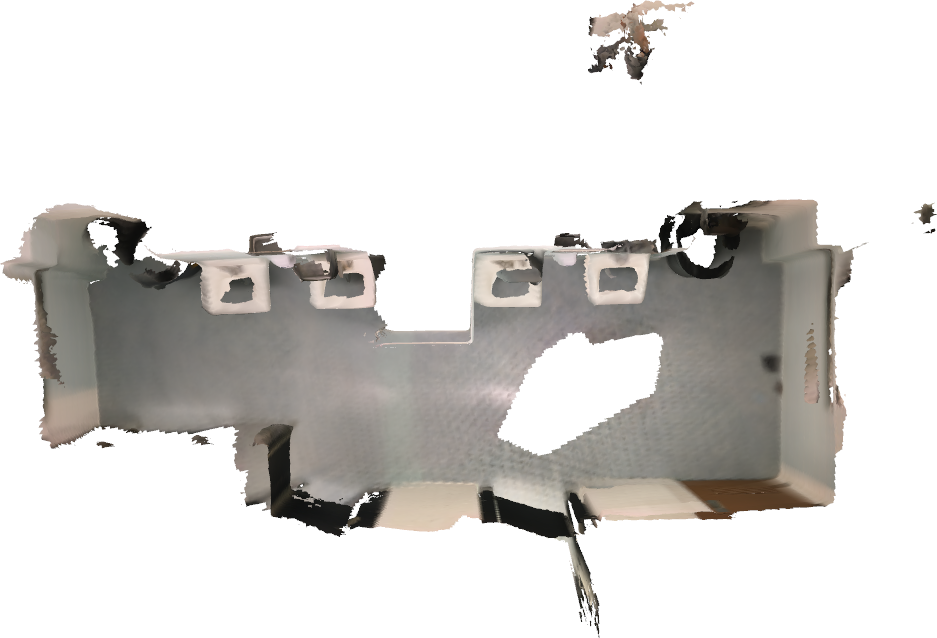
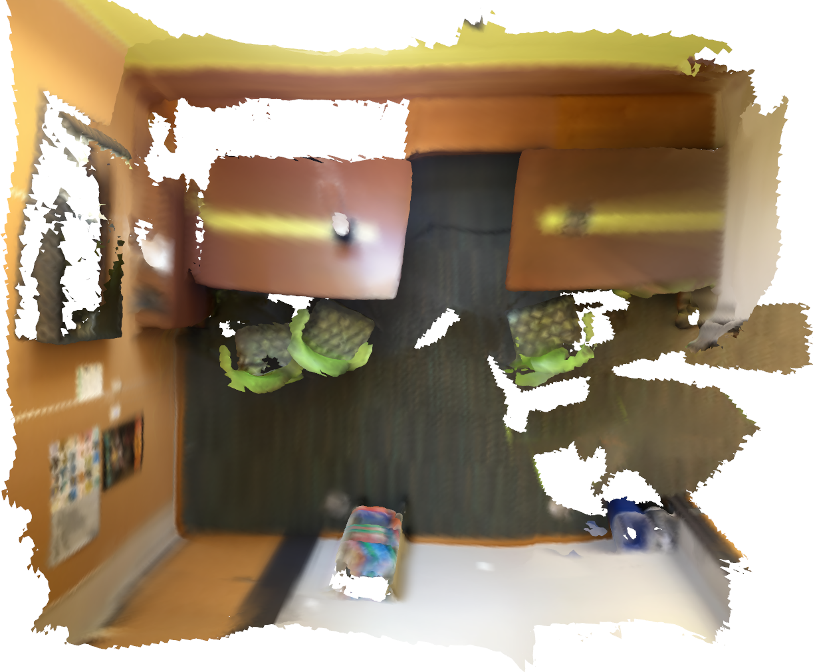
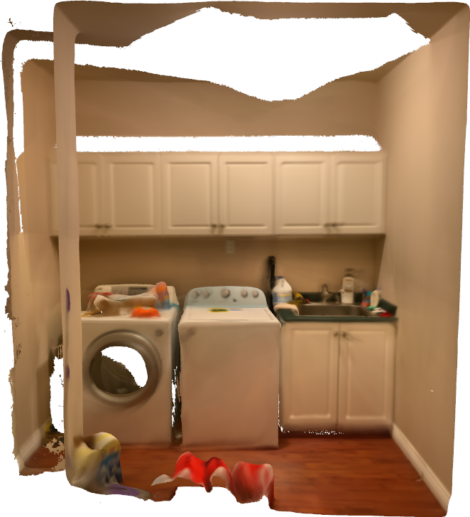
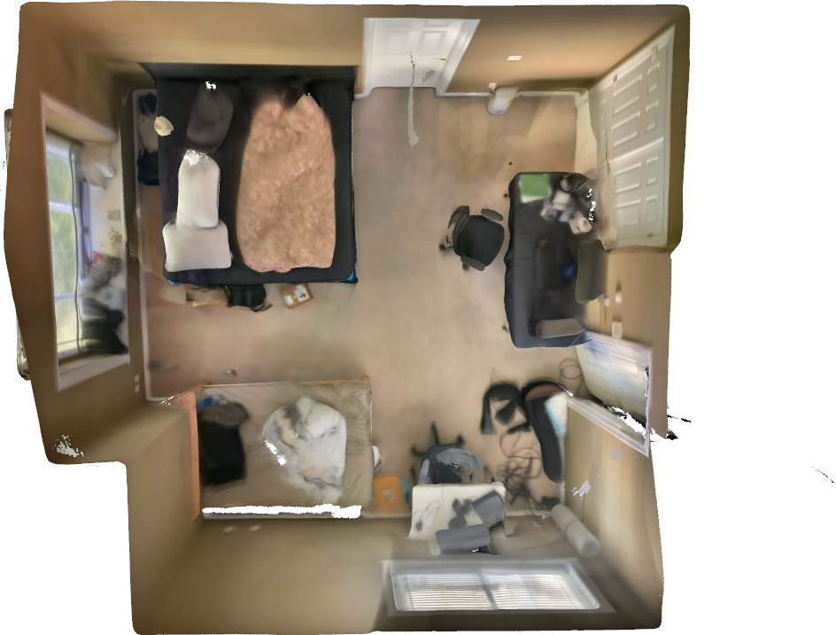
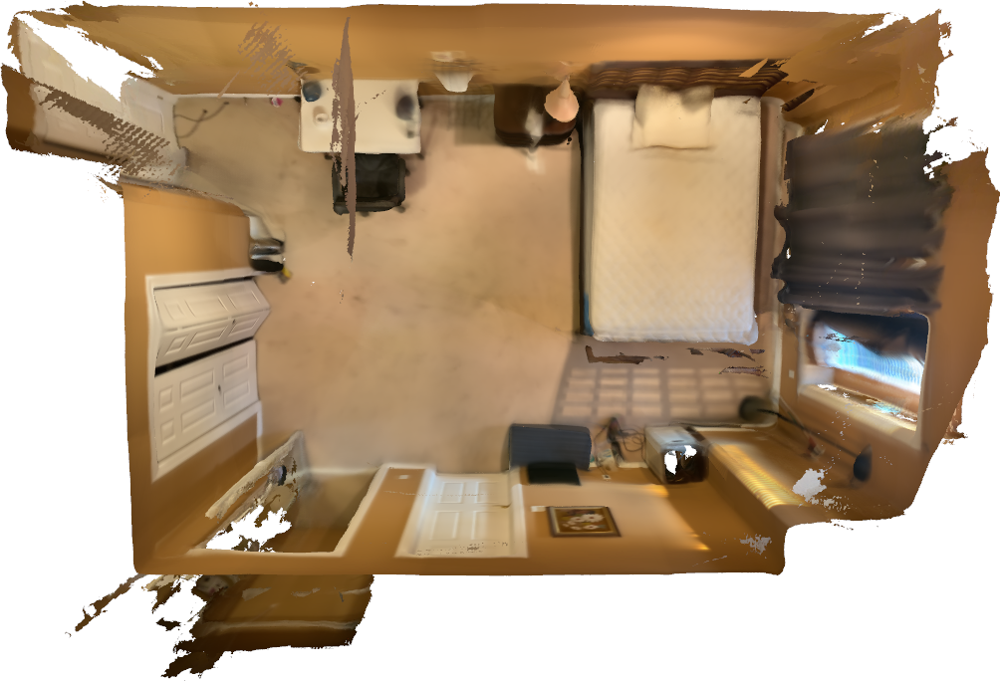

# Open3D RGB-D Reconstruction Pipeline

With apple's LiDAR sensors and ARKit framework, we can aquire RGB color stream, depth stream, confidence maps and camera information of each frame including camera transformation at each frame. 

We offer two main types of reconstruction:
### Reconstruction using RGB and depth images
Using RGB and depth images without access to camera poses of each frame means we need to estimate the camera poses for each frame.  
We use Open3D multiway registration strategy.
1. Divide sequence of frames into batches
2. Reconstruct multiple point cloud fragments with the batches of images
3. Aligning multiple fragments in a global space
4. Obtain camera poses for each frame, use TSDF volume integration and marching cubes to compute the 3D mesh

### Reconstruction using uploaded scans from Scanner app
Camera poses are available from ARKit API for all the captured frames. We don't need to estimate the camera poses.  
Directorily apply volume integration and mesh extraction.
1. Using TSDF volume integration to compute the volume of the scan and marching cubes to extract the triangle mesh.

## Dependencies
* Open3D 0.11.1
* Protocol buffers 3.13.0

## Parameters
### Reconstruction using RGB and depth images
* `-inc/--input_color` *required*, directory color rgb images
* `-ind/--input_depth` *required*, directory of depth images 
* `-ini/--input_intrinsic` *optinal*, json file of camera intrinsic
* `-inp/--input_poses` *optinal*, directory of camera poses, or input path to single camera trajectory file
* `-p/--parallel` *optinal*, run in parallel, default is `True`
* `-num_cpu/--num_cpu` *optinal*, maximum number of cpu processes to use, default maximum number of cpus on device
* `-o/--output` *required*, output directory of reconstruction results
### Reconstruction using uploaded scans from Scanner app
* `-inm/ --input_meta`, *required*, meta data file for uploaded scans
* `-inc/--input_color` *required*, path to .mp4 color stream
* `-ind/--input_depth` *required*, path to .depth.zlib depth stream
* `-inconfi/--input_confidence` *required*, path to .confidence.zlib confidence maps
* `-inp/--input_poses` *required*, path to .jsonl file containing camera information for each frame
* `-inmem/--in_memory` *required*, denotes decoding frames from compressed streams will be done in memory
* `-p/--parallel` *optinal*, run in parallel, default is `True`
* `-num_cpu/--num_cpu` *optinal*, maximum number of cpu processes to use, default maximum number of cpus on device
* `-l/--level` *optinal*, depth value with confidence value equal to or greater than confidence level will be used, default is 1
* `-thresh/--thresh` *optinal*, depth delta filter threshold in meters, default is `0.05`
* `-s/--step` *optinal*, skip frames with a step size, default is 1
* `-trunc/--trunc` *optinal*, truncation value for signed distance function, default is 0.08
* `-voxel/--voxel` *optinal*, length of the voxel in meters, which will be divided by 512, default is 5.0, result in 5.0/512 voxel length
* `-o/--output` *required*, path to reconstruction .ply mesh results

## Compiling 

1. setup environment by `pip install -r requirements.txt`
    - You may need to install Open3D dependencies through [build from source](http://www.open3d.org/docs/release/compilation.html)
    - To enable headless rendering, please follow the instructions on the [headless rendering link](http://www.open3d.org/docs/latest/tutorial/Advanced/headless_rendering.html)

2. sample run:  

* **Reconstruction using RGB and depth images**
```
python main.py -inc path/to/color -ind path/to/depth -o path/to/result

```
* **Reconstruction using uploaded scans from Scanner app**
```
python main.py -inm path/to/metadata/.json -inc path/to/color/.mp4 -ind path/to/depth/.depth.zlib -inconfi path/to/confidence/.confidence.zlib -inp path/to/camera info/.jsonl -inmem -o path/to/result/.ply

```

3. change default reconstruction algorithm parameters in protocol buffer `config/setting.proto`
    - for example, change default value of SDF truncation value during volume integration:  
    - you can change the value `0.08` to other float number after `default`
    - the value `sdf_trunc = 1` denotes the index of `sdf_trunc` variable in the `Integration` message structure
``` cpp
message Integration {
    optional float sdf_trunc = 1 [default = 0.08]; // truncation value for signed distance function
}
```
4. compiling the protocol buffer
    - after change values in the protocol buffer `config/setting.proto` you need to generate the classes you'll need to read and write from the protocol buffer. 
    - Please run following commands after you changed values in `config/setting.proto`:

``` shell
protoc -I=/path/to/dir/config/ --python_out=/path/to/dir/config/ /path/to/dir/config/setting.proto
```

## Implementation Details:

More implementation details about reconstruction pipeline, classes structure, etc. are on the [details.md](doc/details.md)

## Result Examples:
### Reconstruction using RGB and depth images

Example 1                 |    Example 2                  |    Example 3
:-------------------------:|:-------------------------:|:-------------------------:
 |  | 

### Reconstruction using uploaded scans from Scanner app
Example 1                 |    Example 2                  |    Example 3
:-------------------------:|:-------------------------:|:-------------------------:
 |  | 

