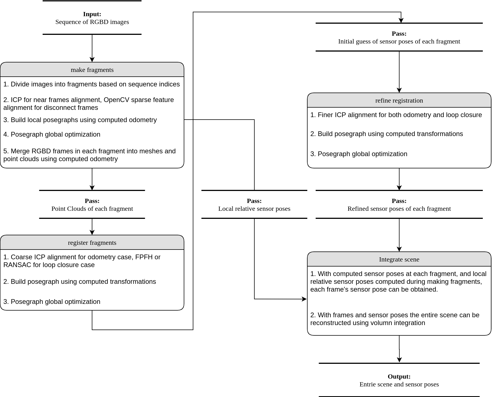
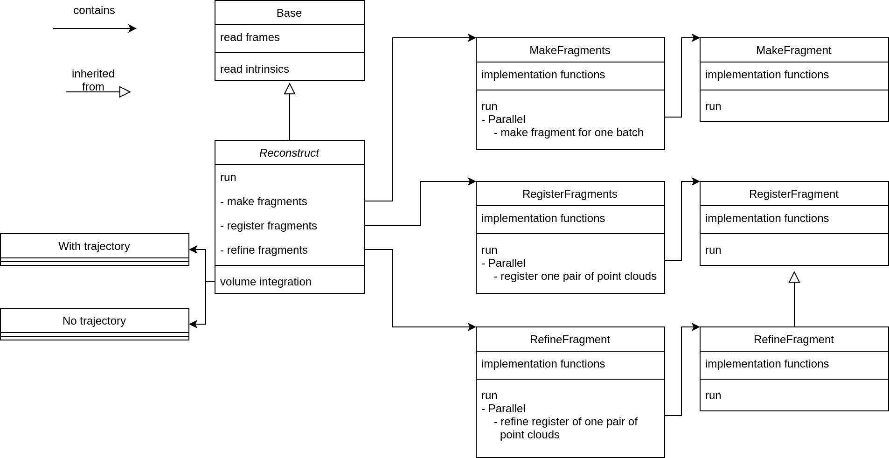

## Details

Our work is based on [Open3D Reconstruction Pipeline](http://www.open3d.org/docs/release/tutorial/reconstruction_system/index.html)

The pipeline has following components:
1. Make fragments
2. Register frames
3. Refine registration
4. Integrate scene

### Reconstruction Pipeline Overview
If the camera poses of each frame are not known, we need to go though the entire pipeline to estimate the camera trajectory. We can also take camera trajectory as input, to directorily perform **Step 4 Integrate scene**.
Following is a picture about the pipeline:

### Classes Structure
For you to better understand the code and our implementation, a picture of the structure of the classes are provided below:
