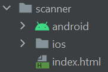
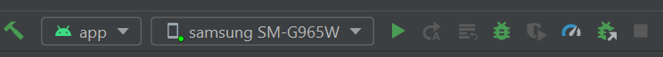
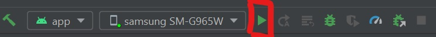
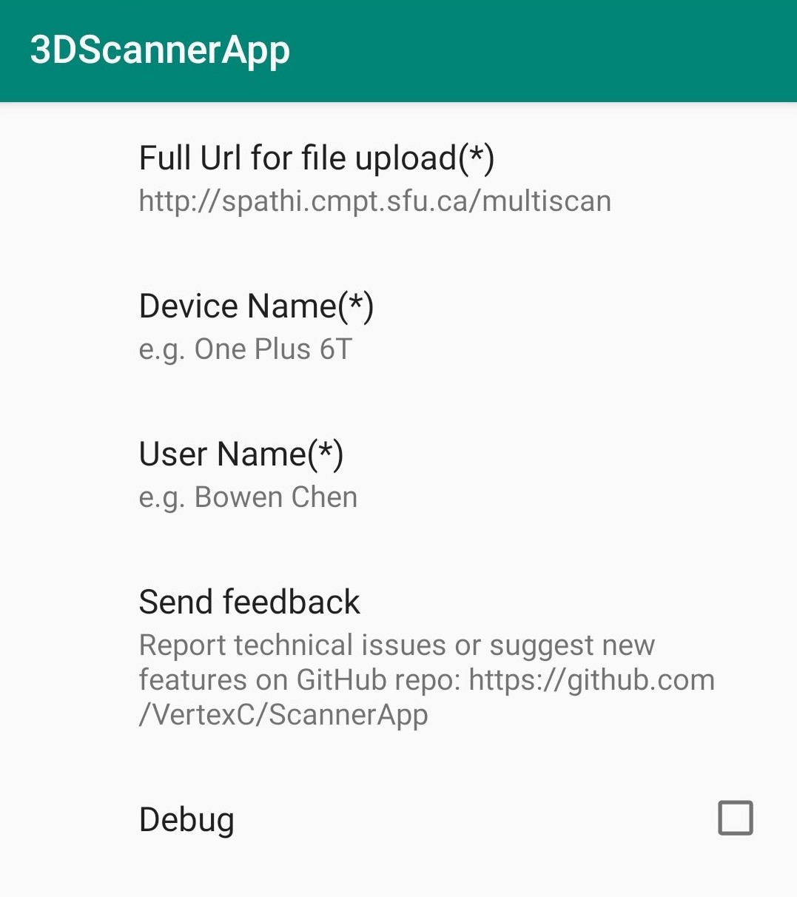
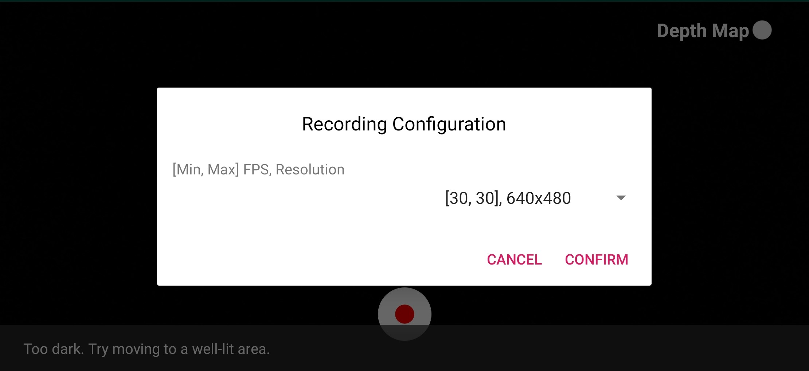
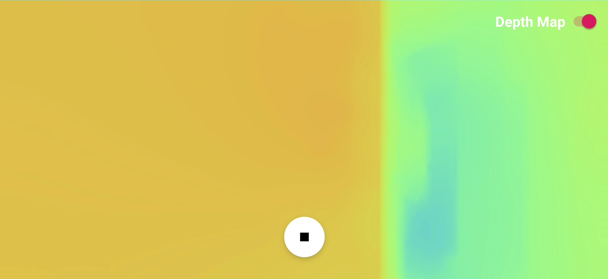
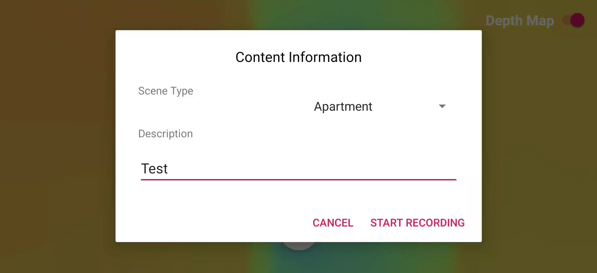
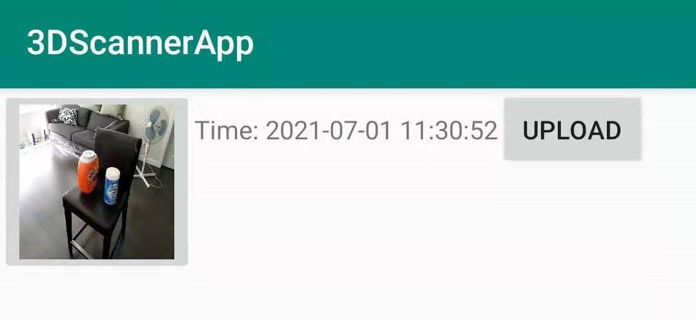

# ScannerApp
Android ScannerApp for ScanNet.

## Basic Functionality
- Record video including:
    - plain video
    - record depth frames if ARCore is available on your phone
- Upload video to ScanNet server for processing.

## Requirements
All Android devices that supports ARCore. See [here](https://developers.google.com/ar/devices) for al ARCore supported devices.

## How to install and run the app
#### Install the app using apk file
- You can download the `.apk` file from [here](./app/build/outputs/apk/debug) and install it on your phone manually.
#### Install the app using Android Studio
- Git clone the [multiscan repo](https://github.com/3dlg-hcvc/multiscan). 
- Open the **android** folder (located at `multiscan/scanner/android`) using [Android Studio](https://developer.android.com/studio).
    - Android Studio will show a Android sign for that folder
        - 
    - Plug in your Android phone to your computer, Android Studio should be able to detect your phone automatically. You can check it by verifying the model name on top right of the Android Studio.
        - You might see a permission dialog pop up on your phone which you need to press accept
        - 
        - If you encounter any problems connecting your android device to Android Studio:
            - [Enable USB debugging on your phone](https://developer.android.com/studio/debug/dev-options)
            - You should also go to `File->Project Structure->Modules` and change the `compile SDK version` to `29` and `Build Tools version` to `24.0.3`
            - Or visit [here](https://developer.android.com/studio/run/device#connect) for more details
    - Then click the green play icon. Android Studio will then build the app and install it on you phone
        - 
    - Once the installation is complete, you can then unplug your phone and use the App.

## User Guide
### Configuration
Go to the `Configuration` page to input user info and server url

Note: The URL format is http://`host_name`:`port_number`/`path`

    

### Video and depth data capture (ARCore)
1. Click the `VIDEO CAPTURE (ARCORE)`
2. Choose the resolution and FPS for the color frame recording

    

3. You can use the switch on **top right** to toggle between camera view or depth view
    - **Note: If you turned on the depth view and the screen is black, try move your phone around and don't start recording until you see the actual depth image.**

    
    

4. Click the record button
    - Note: The recorded color frame will not include the depth view, only the camera view  
5. Choose the scene and the add your description  
6. Click the stop recording button to stop the recording

### Gallery
Go to the Gallery page if you want to view previously recorded scenes. Tab the thumbnail to rewatch the video and tab the upload button to upload the files to the server.

    

## Documentation
[Code Doc](https://3dlg-hcvc.github.io/multiscan/android)
