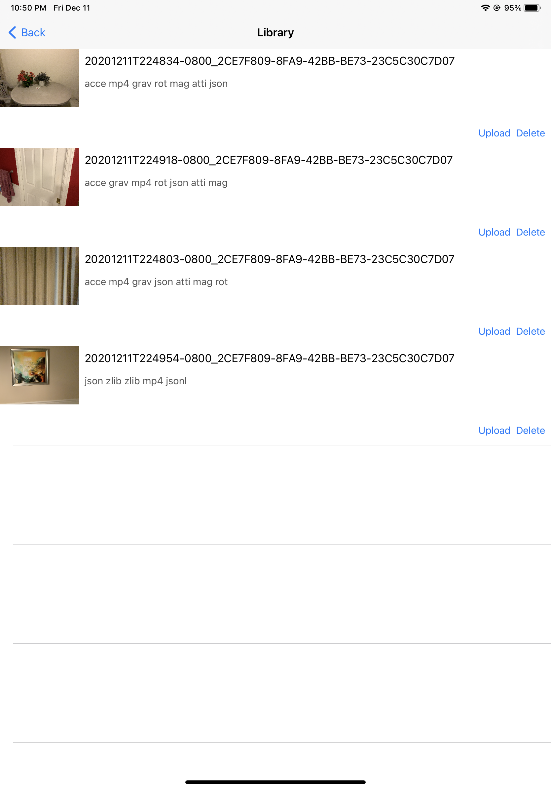
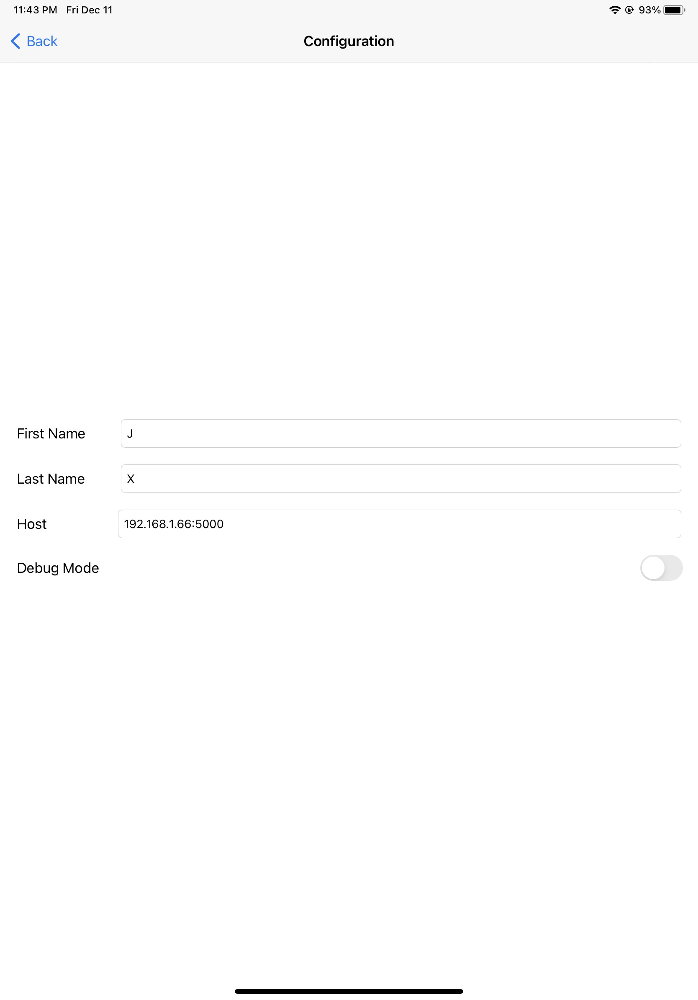

# Scanner App (iOS)

The Scanner App collects data using sensors on an iOS device. The Scanner App has three modes, single camera, dual camera and RGB-D. We currently only support the single camera mode and the RGB-D mode, and the dual camera mode is not completed and still in progress.

## Scanner App Workflow

We use the scanner app to scan the environment and collect data. Users will be asked to input user information (e.g. name, scene type, etc.) before scanning the environment. Once the scanning completed, users can upload the data to the staging server.

### Recording

User can navigate to respective recording scene by tapping Camera, DualCam (dual cam mode currently in progress and is not supported yet) or LiDARDepth button on the main menu.

From a recording scene, users can tapped "Record" button to initiate the recording process. A pop-up view will show for collecting user inputs, and once the required information is filled, users can start scanning by tapping "Start Recording". Users can stop scanning by tapping "Stop" button.

#### Output Files

Files generated by each mode are as follow:

Single camera

* a metadata file
* an RGB video
* five motion data files
  * rotation rate
  * user acceleration
  * magnetic field
  * attitude
  * gravity

Dual camera (in progress)

* a metadata file
* two RGB videos
* five motion data files (same to single camera)

RGB-D

* a metadata file
* an RGB video
* a file for depth maps
* a file for confidence maps
* a camera information file

For file formats, please refer to the [data formats](#data-formats) section.


### Library and Uploading

Scans can be accessed and uploaded from the library scene. From the library scene, tap the "Upload" button of each scan to upload files to the staging server, and tap "Delete" button to delete each scan. User can also tap on each row to see scan details (currently just the metadata file).

<!--  -->
<!--  -->


### Configuation

From the configuration scene, users can edit user information as well as setting the host for uploading.

<!--  -->
<!--  -->


----

## Requirements

### Single camera

* iOS 12.0 or newer

### Dual camera

* iOS 13.0 or newer
* A12/A12X processor or above

### RGB-D

* iOS 14.0 or newer
* LiDAR sensor required

----

## Data Formats

Each scan has a unique identifier in the format of <yyyyMMdd_HHmmss>_<device_id>. Files of a scan use the scan id as filename and they have different file extensions.

* metadata (```<scanId>.json```)
* RGB video (```<scanId>.mp4```)
* motion data files
  * rotation rate (```<scanId>.rot```)
  * user acceleration (```<scanId>.acce```)
  * magnetic field (```<scanId>.mag```)
  * attitude (```<scanId>.atti```)
  * gravity (```<scanId>.grav```)
* depth data (```<scanId>.depth.zlib```)
* confidence maps data (```<scanId>.confidence.zlib```)
* camera info (```<scanId>.jsonl```)

### metadata

Metadata file is a json file which contains user information, scene information, device information, framerate of streams, etc.

For an example of metadata file, please refer to [here](res/sample-files/metadata-example.json)

### RGB video

On an iPad pro 11-inch (2nd generation), the RGB videos recorded in single camera mode and RGB-D mode are at 1440 x 1920 resolution and 60 FPS.

### depth maps and confidence maps (only in RGB-D mode)

Depth maps and confidence maps are provided by the Depth API of ARKit 4. Depth maps and confidence maps are available at 192 x 256 resolution and 60 FPS on an iPad pro 11-inch (2nd generation).

We store depth as 16-bit floating number (write frame by frame in a single file) and then zlib compress.

Confidence maps contain corresponding confidence level of each depth data. There are three confidence level low (0), medium (1) and high (2). We store them as 8-bit unsigned integers and then zlib compress.

### camera information (only in RGB-D mode)

A camera info file contains information of camera pose, camera intrinsics at each frame. Camera info files are in json line format.

For an example of camera info file, please refer to [here](res/sample-files/camera-info-example.jsonl)

----

## Development Notes

### [CameraViewController](ScannerApp-Swift/Controller/CameraViewController.swift)

CameraViewController is the common view controller for all recording scenes. CameraViewController is responsible for setting up the UI according to recording mode. It has an instance of [RecordingManager](#RecordingManager) and the RecordingManager is instantiated according to the recording mode when the CameraViewController is loaded.

### [RecordingManager](ScannerApp-Swift/Model/RecordingManager/RecordingManager.swift)

A RecordingManager is responsible for handling all recording related things including session configuration, start and stop recordings, etc.. The RecordingManager protocol defines the required properties and methods for each concrete subclass, and there are three implementations (there are only two in this version, the one for dual camera is not included) of RecordingManager corresponding to the three recording modes.

#### SingleCameraRecordingManager

SingleCameraRecordingManager uses the AVFoundation framework and it has a AVCaptureSession. It has a [MotionManager](#MotionManager) responsible for recording motion data.

#### DualCameraRecordingManager (in progress)

SingleCameraRecordingManager also uses the AVFoundation framework and it has a AVCaptureMultiCamSession.

The dual camera mode is currently in progress.

#### ARCameraRecordingManager

ARCameraRecordingManager uses the ARKit framework and it has a ARSession. It processes the data from session update (RGB images, depth maps, confidence maps, camera info). It has four [Recorder](#Recorder)s for recording the four types of data.

### [MotionManager](ScannerApp-Swift/Model/MotionManager.swift)

MotionManger has a CMMotionManager and it handles motion data recording for the single camera and dual camera mode (RGB-D mode records camera poses in different way).

As mentioned above, MotionManager currently records 1) rotation rate, 2) user acceleration, 3) magnetic field, 4) attitude, and 5) gravity.

### [Recorder](ScannerApp-Swift/Model/Recorder/Recorder.swift)

Recorders are responsible for writing data to files frame by frame using the ```update()``` method. Currently, there are four implementations of Recorder being used, including RGBRecorder, DepthRecorder, ConfidenceMapRecorder and CameraInfoRecorder.

Recorders are only used in RGB-D mode at the moment.
