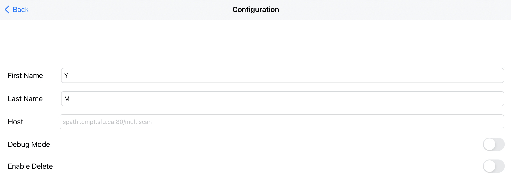
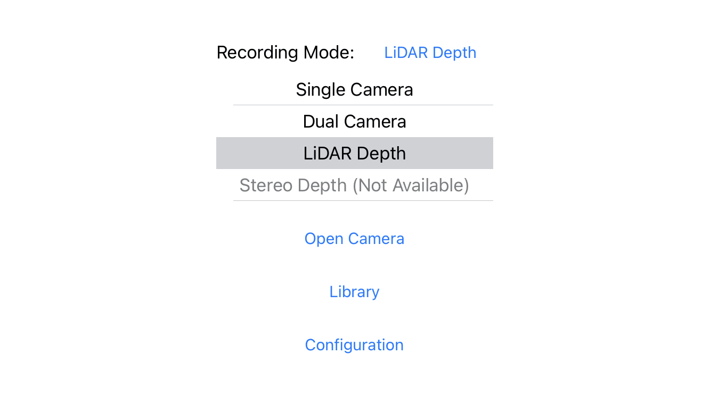
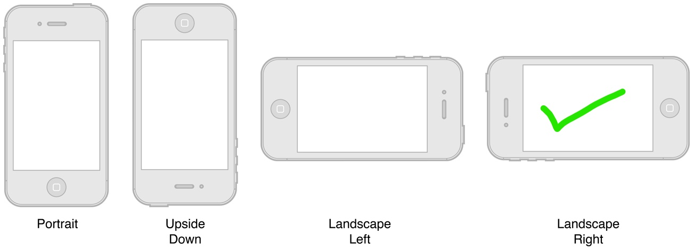
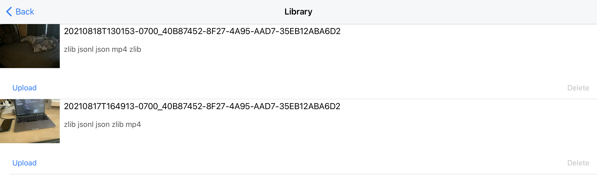
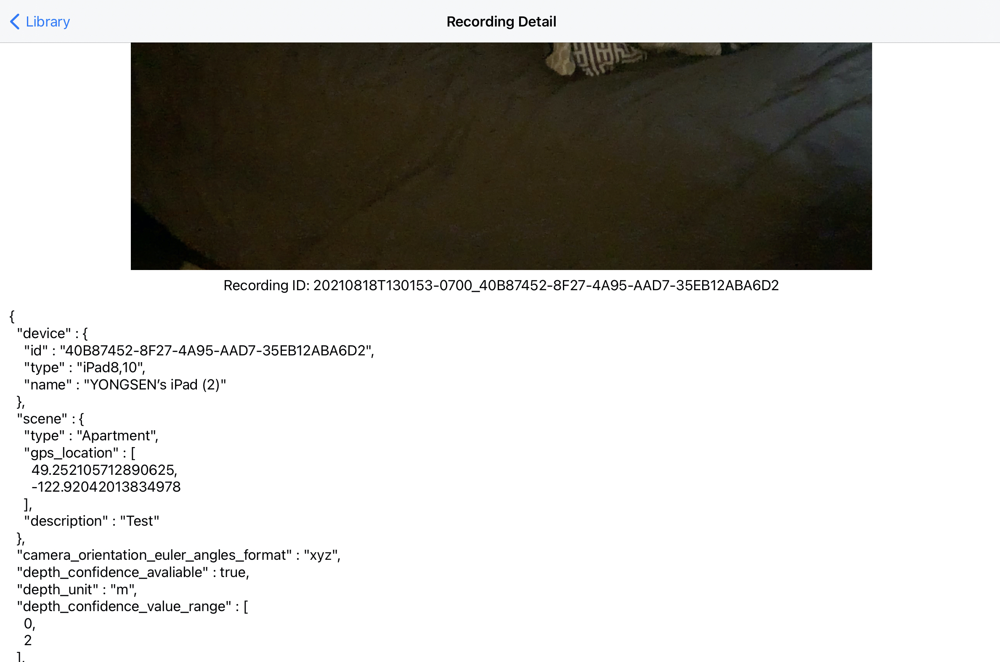
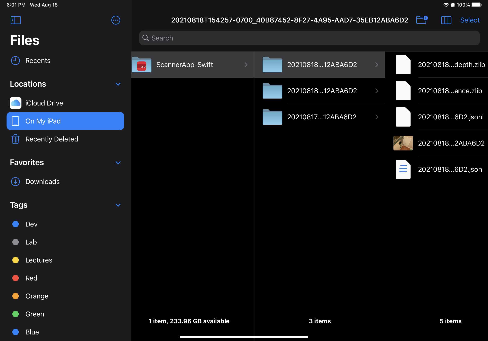
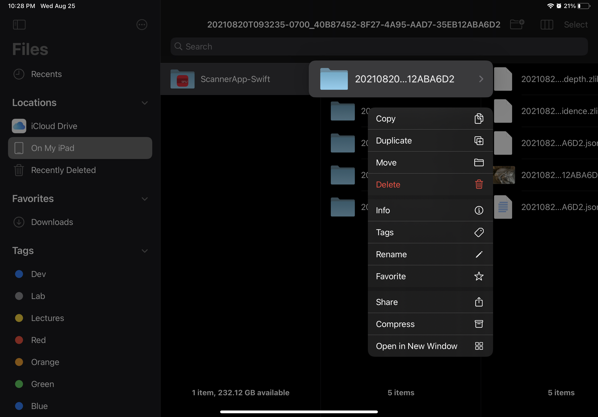

# Scanner App (iOS)

The Scanner App collects data using sensors on an iOS device. The Scanner App has three modes, single camera, dual camera and RGB-D. We currently only support the single camera mode and the RGB-D mode, and the dual camera mode is not completed and is still in progress.

## App Requirements

### Single camera

* iOS 12.0 or newer

### Dual camera

* iOS 13.0 or newer
* A12/A12X processor or above

### LiDAR Depth (RGB-D)

* iOS 14.0 or newer
* LiDAR sensor required

## Installation
1. Make sure you have installed the latest version of [Xcode](https://developer.apple.com/xcode/) on your Mac computer.
2. Clone the [multiscan repo](https://github.com/3dlg-hcvc/multiscan).
3. Open project folder [ScannerApp-Swift.xcodeproj](./ScannerApp-Swift.xcodeproj) using Xcode on Mac. This folder can be found at `multiscan/scanner/ios`
4. In the left project navigator window, click the first project file, and select `TARGETS` `ScannerApp-Swift`.
5. In Build Settings, find the field `Signing/Development` Team, change the team to your personal team. If you don't see your personal team option, please sign in your apple account in the `Xcode/Preferences/Accounts`.
6. In Build Settings, find the field `Packaging/Product Bundle Identifier`, change the identifier to username.ScannerApp.
7. On the top bar, switch device to iOS Device to your iPad.
8. Build and run the current scheme, and the scanner app should be installed to your iPad device.

## User Manual

### Configuration

From the configuration scene, users can edit user information as well as setting the host for uploading.

The `Enable Delete` option can be disabled to prevent users to delete scenes by accident.

<p align="middle">
	
</p>

### Mode Selection
On the main screen, user can choose the recording mode. We recommend to use LiDARDepth for the best result.

<p align="middle">
	
</p>

### Recording

From a recording scene, users can tap the "Record" button to initiate the recording process. A pop-up view will show for collecting user inputs, and once the required information is filled, users can start scanning by tapping "Start Recording". Users can stop scanning by tapping "Stop" button.

The App also uses ARKit to construct a mesh wire frame overlay to help users to record a better quality scene.


Note: While recording, please hold your device in "**Landscape Right**" position.

<p align="middle">
	
</p>

### Library and Uploading

Scans can be accessed and uploaded from the library scene. From the library scene, tap the "Upload" button of each scan to upload files to the staging server **(Internet connection required)**, and tap "Delete" button to delete each scan. User can also tap on each row to see scan details (currently just the metadata file).

<p align="middle">
	
</p>
<p align="middle">
	
</p>


Users can also view and share the files directly using the iOS' builtin `Files` App. The files will be stored in `Files->ScannerApp-Swift->scanner_ID`

<p align="middle">
	
	
</p>

## Files generated for each scene
**For detailed file formats, refer to [file types and data formats](../../docs/staging_file_format.md)**

### Metadata

Metadata file is a json file which contains user information, scene information, device information, frame rate of streams, etc.

### RGB video

On an iPad pro 11-inch (2nd generation), the RGB videos recorded in single camera mode and RGB-D mode are at 1920 x 1440 resolution and 60 FPS.

### Depth Maps and Confidence Maps (Only in RGB-D mode)

Depth maps and confidence maps are provided by the Depth API of ARKit 4. Depth maps and confidence maps are available at 256 x 192 resolution and 60 FPS on an iPad pro 11-inch (2nd generation).

We store depth as 16-bit floating number (write frame by frame in a single file) and then zlib compress.

Confidence maps contain corresponding confidence level of each depth data. There are three confidence level low (0), medium (1) and high (2). We store them as 8-bit unsigned integers and then zlib compress.

### Camera Information (only in RGB-D mode)

A camera info file contains information of camera pose, camera intrinsics at each frame. Camera info files are in json line format.

#### Apple's ARKit Camera Pose Convention:

In camera space, the x-axis points to the right when the device is in `UIDeviceOrientation.landscapeRight orientation`. That is, the x-axis always points along the long axis of the device, from the front-facing camera toward the Home button. The y-axis points upward (with respect to `UIDeviceOrientation.landscapeRight` orientation), and the z-axis points away from the device on the screen side.

## Development Notes

For full code doc, refer to [here](https://3dlg-hcvc.github.io/multiscan/ios).

#### [CameraViewController](ScannerApp-Swift/Controller/CameraViewController.swift)

CameraViewController is the common view controller for all recording scenes. CameraViewController is responsible for setting up the UI according to recording mode. It has an instance of [RecordingManager](#RecordingManager) and the RecordingManager is instantiated according to the recording mode when the CameraViewController is loaded.

#### [RecordingManager](ScannerApp-Swift/Model/RecordingManager/RecordingManager.swift)

A RecordingManager is responsible for handling all recording related things including session configuration, start and stop recordings, etc.. The RecordingManager protocol defines the required properties and methods for each concrete subclass, and there are three implementations (there are only two in this version, the one for dual camera is not included) of RecordingManager corresponding to the three recording modes.

#### SingleCameraRecordingManager

SingleCameraRecordingManager uses the AVFoundation framework and it has a AVCaptureSession. It has a [MotionManager](#MotionManager) responsible for recording motion data.

#### DualCameraRecordingManager (in progress)

SingleCameraRecordingManager also uses the AVFoundation framework and it has a AVCaptureMultiCamSession.

The dual camera mode is currently in progress.

#### ARCameraRecordingManager

ARCameraRecordingManager uses the ARKit framework and it has a ARSession. It processes the data from session update (RGB images, depth maps, confidence maps, camera info). It has four [Recorder](#Recorder)s for recording the four types of data.

#### [MotionManager](ScannerApp-Swift/Model/MotionManager.swift)

MotionManger has a CMMotionManager and it handles motion data recording for the single camera and dual camera mode (RGB-D mode records camera poses in different way).

As mentioned above, MotionManager currently records 1) rotation rate, 2) user acceleration, 3) magnetic field, 4) attitude, and 5) gravity.

#### [Recorder](ScannerApp-Swift/Model/Recorder/Recorder.swift)

Recorders are responsible for writing data to files frame by frame using the ```update()``` method. Currently, four implementations of Recorder are being used, including RGBRecorder, DepthRecorder, ConfidenceMapRecorder and CameraInfoRecorder.

Recorders are only used in RGB-D mode at the moment.
